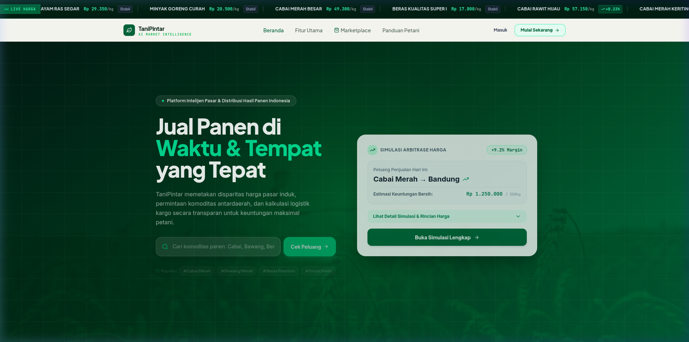
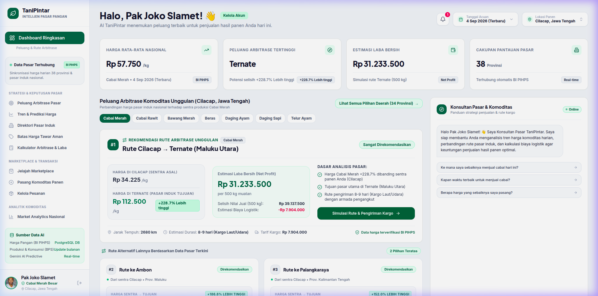
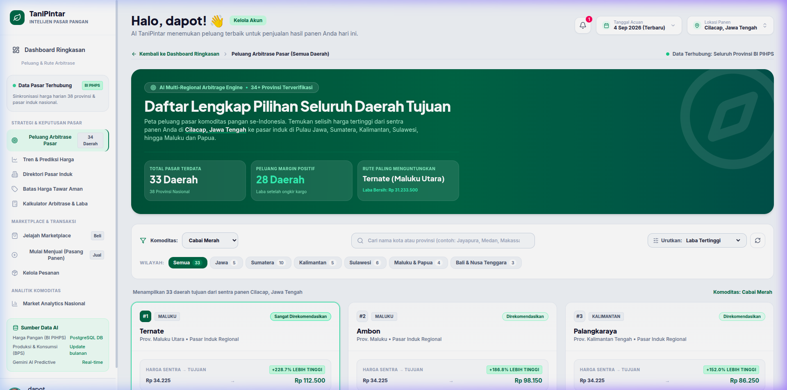
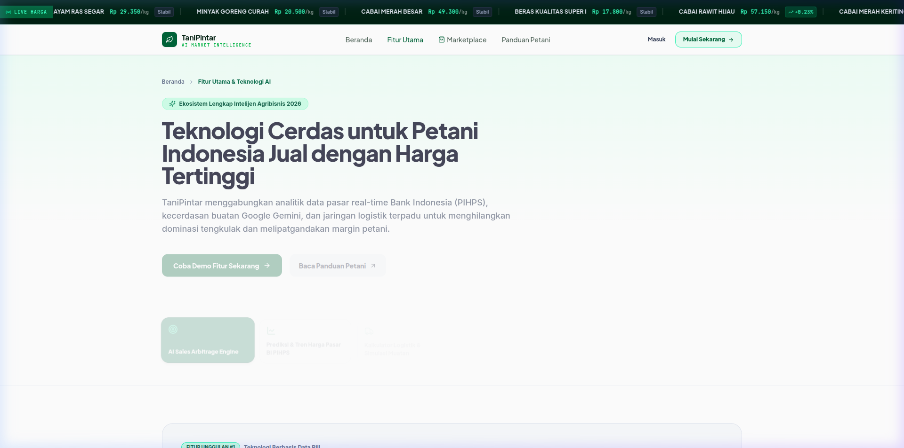
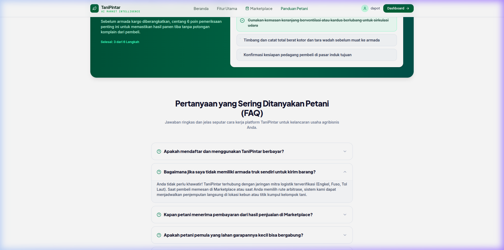
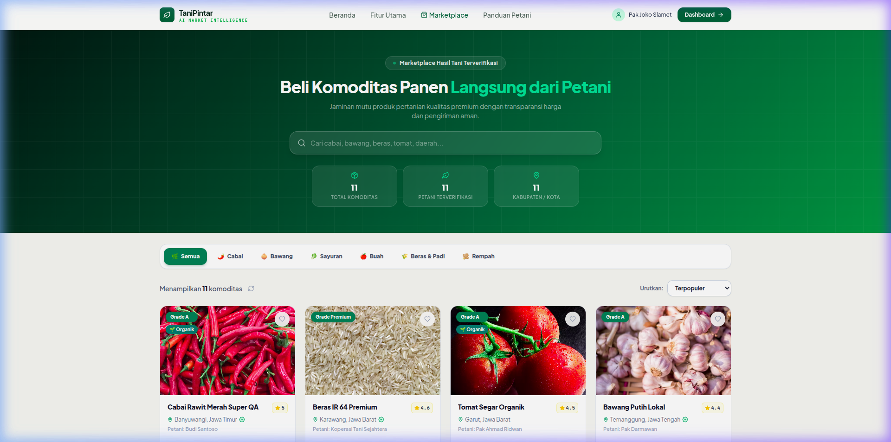
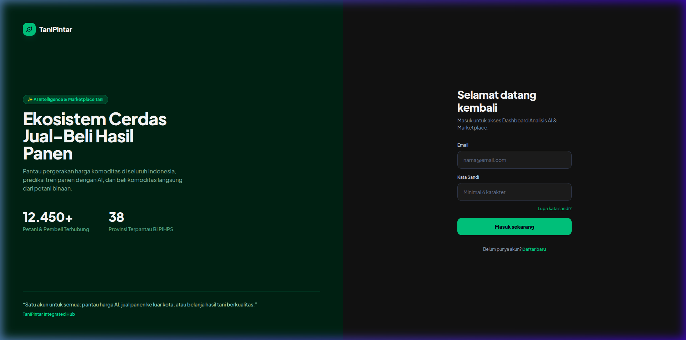
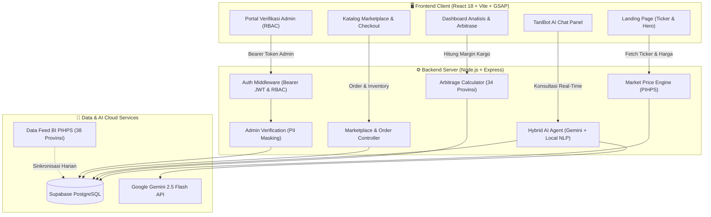
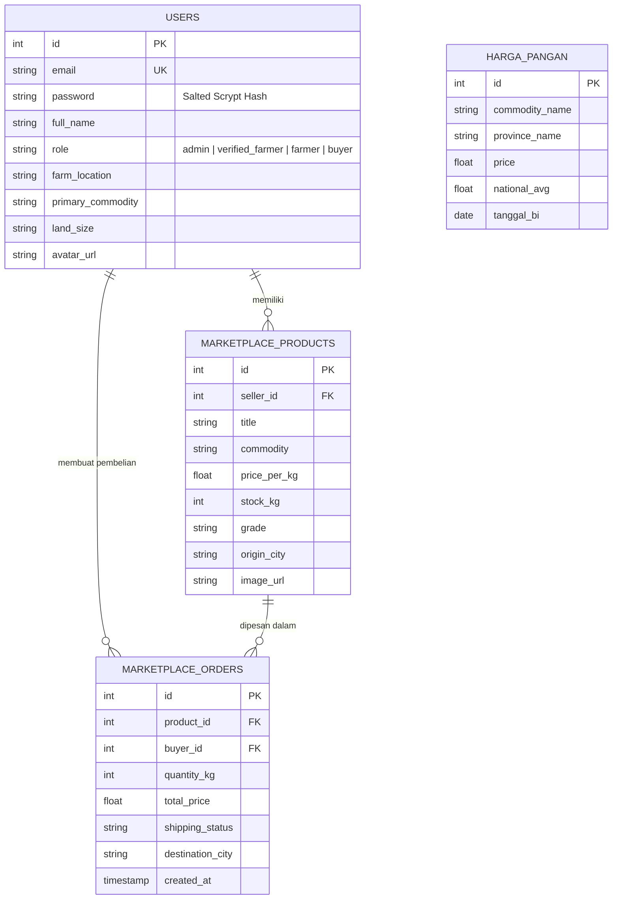

<div align="center">

  # 🌾 TaniPintar
  ### Platform Intelijen Pasar Pangan & Marketplace Agribisnis Berbasis AI untuk Optimalisasi Rantai Pasok Nasional

  [](https://tanipintar.potydev.cloud)
  [](https://youtu.be/uXkusN3y2yw)
  [](https://github.com/potydev/Tani-Pintar)
  [](LICENSE)

  **Submission for ITECHNO CUP 2026 - Web Development Competition**

  **Developed with ❤️ by Tim Magic Chess: Go Go**

</div>

---

## 📋 Daftar Isi

- [Tentang Proyek](#-tentang-proyek)
  - [Latar Belakang Permasalahan](#latar-belakang)
  - [Solusi yang Ditawarkan](#solusi-yang-ditawarkan)
  - [Tujuan & Value Proposition](#tujuan-proyek)
- [Akun Demo untuk Juri & Penguji](#-akun-demo-untuk-pengujian--juri)
- [Fitur Unggulan](#-fitur-unggulan)
- [Demo & Screenshot Aplikasi](#-demo--screenshot)
- [Teknologi & Tech Stack](#%EF%B8%8F-teknologi)
- [Arsitektur Sistem & Basis Data](#%EF%B8%8F-arsitektur-sistem)
- [Instalasi & Setup Lokal](#%EF%B8%8F-instalasi--setup)
- [Panduan Penggunaan](#-penggunaan)
- [Dokumentasi API](#-api-documentation)
- [Hasil Pengujian & QA (43/43 Passed)](#-testing)
- [Tim Pengembang](#-tim-developer)
- [Lisensi](#-lisensi)

---

## 👥 Tim Developer

**Nama Tim:** `Magic Chess: Go Go`

| Nama | Peran | GitHub |
|------|-------|--------|
| **Dapot Matthew Tampubolon** | Project Lead & Full Stack Developer | [@potydev](https://github.com/potydev) |
| **Sunu Setyo Jati** | Analisis Data | [@nullcurio](https://github.com/nullcurio) |
| **Ahmad Fakhri Abdullah** | UI/UX Designer | [@ahmfakhri](https://github.com/ahmfakhri) |

---

## 🔑 Akun Demo (Untuk Pengujian & Juri)

Untuk mempermudah pengujian seluruh fitur aplikasi tanpa perlu registrasi ulang, silakan gunakan kredensial akun berikut:

| Kategori Akun | Email Login | Kata Sandi | Hak Akses & Fitur yang Dapat Diuji |
|---|---|---|---|
| **🌾 Petani Binaan (Verified Farmer)** | `petani.baru@tanipintar.id` | `rahasia123` | **Dashboard Lengkap:** Simulasi Arbitrase Antar-Provinsi (34 Daerah), Konsultan TaniBot AI, Pasang Komoditas Panen ke Marketplace, Kelola Pesanan Masuk, Notifikasi Pasar Real-Time. |
| **🛡️ Administrator Platform** | `admin@tanipintar.id` | `admin123` | **Portal Khusus Admin (`/admin`):** Role-Based Access Control (RBAC), Verifikasi Kelayakan Berkas Petani, Pengawasan Transaksi Nasional, Sensor Otomatis Data Sensitif (PII Masking NIK & Rekening). |

> 💡 **Catatan:** Penguji juga dapat membuat akun baru melalui halaman [Daftar Baru](https://tanipintar.potydev.cloud/login?mode=register) untuk menguji alur onboarding dan sistem isolasi data akun baru.

---

## 🎯 Tentang Proyek

### Latar Belakang
Petani di Indonesia sering kali berada pada posisi paling lemah dalam rantai nilai pangan (*agricultural value chain*):
1. **Asimetri Informasi Harga**: Petani di sentra produksi kerap tidak mengetahui harga komoditas di pasar induk kota besar dan luar pulau.
2. **Disparitas Harga Ekstrem Antar-Wilayah**: Sebagai contoh nyata dari data Bank Indonesia (PIHPS), harga Cabai Merah di sentra panen Cilacap berkisar **Rp 34.225/kg**, sementara di Pasar Induk Ternate mencapai **Rp 112.500/kg** (terdapat selisih harga lebih dari **+228.7%**).
3. **Ketergantungan pada Tengkulak / Ijon**: Petani terpaksa menjual hasil panen dengan harga sangat rendah karena ketiadaan akses logistik kargo langsung dan alternatif pasar tujuan.

### Solusi yang Ditawarkan
**TaniPintar** hadir sebagai platform terintegrasi *AI Market Intelligence & B2B Agribusiness Marketplace* yang:
- **Menghubungkan Data Riil Pasar Pangan**: Mengintegrasikan data harian Bank Indonesia (BI PIHPS) dari **38 provinsi** se-Indonesia.
- **Memberikan Rekomendasi Arbitrase Cerdas**: Algoritma cerdas menghitung selisih harga, tarif kargo logistik per tonase, jarak tempuh, estimasi susut panen, hingga proyeksi laba bersih (*Net Profit*) ke seluruh 34 provinsi.
- **Menyediakan TaniBot AI Hybrid Consultant**: Asisten berbasis Google Gemini 2.5 Flash yang diinjeksikan data harga riil untuk mendampingi strategi tawar-menawar menghadapi tengkulak, rekomendasi waktu panen, serta panduan agronomi.
- **Marketplace Terverifikasi Tanpa Perantara**: Menghubungkan petani langsung dengan pembeli grosir, pelaku industri kuliner/Horeka, dan pasar induk dengan jaminan keamanan transaksi dan isolasi pesanan.

### Tujuan Proyek
- 🎯 **Tujuan Utama**: Meningkatkan margin pendapatan riil petani hingga 2-3x lipat melalui keterbukaan data harga nasional dan akses pasar lintas pulau.
- 📊 **Target Pengguna**: Petani lokal, Gabungan Kelompok Tani (Gapoktan), pedagang pasar induk, distributor kargo, serta pembeli komoditas pangan grosir.
- 💡 **Value Proposition**: Pelopor platform agribisnis pertama di Indonesia yang mengawinkan **AI Cross-Province Arbitrage Engine**, **Hybrid NLP Agronomy Consultant**, dan **Verified Direct Marketplace** dalam satu ekosistem interaktif dan responsif berkecepatan 60 FPS.

---

## ✨ Fitur Unggulan

### Fitur Utama

| Fitur Unggulan | Deskripsi Singkat | Keunggulan Inovasi |
|----------------|-------------------|--------------------|
| **AI Market Arbitrage Simulator (34 Provinsi)** | Mesin kalkulasi keuntungan antar-wilayah dari sentra panen petani menuju seluruh kota pasar induk se-Indonesia. | Menghitung otomatis tarif kargo laut/darat/udara, jarak km, susut panen, dan laba bersih per 500 kg muatan. Dilengkapi filter pulau dan visual perbandingan instan. |
| **TaniBot AI Hybrid Consultant** | Konsultan digital pintar berbasis Google Gemini 2.5 Flash dengan arsitektur Hybrid NLP Fallback Engine. | Prompt AI diinjeksikan data harga pangan Supabase secara dinamis sehingga jawaban akurat, kontekstual, dan mengedukasi strategi tawar di depan tengkulak. |
| **B2B Verified Agribusiness Marketplace** | Katalog komoditas hasil panen langsung dari petani binaan lengkap dengan detail grade (Grade A/B), kuantitas, dan lokasi panen. | Transaksi terisolasi penuh per akun, proteksi stok otomatis (*stock auto-decrement*), dan pelacakan status kargo transparan. |
| **Panduan Interaktif Petani (`/panduan`)** | 5 bab kurikulum praktis agribisnis: strategi panen, negosiasi tengkulak, standar pengemasan kargo, hingga pemanfaatan data PIHPS. | Dilengkapi *Interactive Pre-Shipment Checklist* reaktif dengan progress bar dinamis dan FAQ accordion agribisnis. |
| **Fitur Utama & Interactive Demonstrator (`/fitur`)** | Showcase teknologi interaktif 6 pilar inovasi TaniPintar dengan komparasi langsung metode lama vs AI Platform. | Pengunjung dapat mencoba demonstrasi simulasi rute, tren harga, dan kalkulator logistik secara langsung tanpa mendaftar. |
| **Portal Admin Berstandar Keamanan Tinggi** | Panel pengawasan admin (`/admin`) untuk verifikasi identitas petani binaan dan monitoring komoditas pangan. | Proteksi token kriptografis Bearer JWT, penolakan akses ilegal (RBAC), serta enkripsi dan sensor otomatis data sensitif (*PII Masking*). |

### Fitur Tambahan
- **Real-Time Price Ticker**: Running text harga pangan harian nasional di halaman beranda.
- **Safe Bidding Boundary (Batas Harga Tawar Aman)**: Rekomendasi batas bawah dan batas atas harga penawaran agar petani tidak rugi.
- **Sistem Notifikasi Riil Multi-Kategori**: Notifikasi real-time untuk sinyal arbitrase menguntungkan, status pesanan belanjaan, dan edukasi pasar.
- **Animasi GSAP 60 FPS Halus**: Pengalaman visual modern menggunakan GreenSock (GSAP & ScrollTrigger) dengan akselerasi GPU tanpa flicker atau layout shift.

---

## 📸 Demo & Screenshot

### Tautan Demo Resmi
- 🔗 **Website Live Demo**: [https://tanipintar.potydev.cloud](https://tanipintar.potydev.cloud)
- 📹 **Video Demo YouTube**: [https://youtu.be/uXkusN3y2yw](https://youtu.be/uXkusN3y2yw)
- 💻 **Repositori GitHub**: [https://github.com/potydev/Tani-Pintar](https://github.com/potydev/Tani-Pintar)

### Galeri Antarmuka Aplikasi

<div align="center">

  ### 1. Halaman Beranda / Landing Page
  
  <p><em>Tampilan beranda dengan ticker harga harian 38 provinsi, metrik ekosistem petani, dan navigasi modern</em></p>

  <br/>

  ### 2. Dashboard Analitik & Rekomendasi Arbitrase
  
  <p><em>Panel kendali petani: 4 kartu metrik KPI, rekomendasi rute arbitrase tertinggi, dan asisten TaniBot AI</em></p>

  <br/>

  ### 3. Eksplorasi Arbitrase Seluruh Daerah (34 Provinsi)
  
  <p><em>Daftar komparasi peluang margin laba ke seluruh pasar induk di Indonesia dengan filter pulau dan kalkulator rute</em></p>

  <br/>

  ### 4. Interactive Feature Demonstrator (`/fitur`)
  
  <p><em>Showcase interaktif 6 pilar teknologi cerdas dan tabel komparasi 'Cara Lama vs TaniPintar Platform'</em></p>

  <br/>

  ### 5. Panduan Edukasi Petani & Interactive Checklist (`/panduan`)
  
  <p><em>Kurikulum agribisnis interaktif: Checklist pra-pengiriman kargo dan strategi menghadapi tengkulak</em></p>

  <br/>

  ### 6. Agribusiness Marketplace Terverifikasi
  
  <p><em>Katalog komoditas hasil panen langsung dari petani binaan dengan filter komoditas dan pemesanan instan</em></p>

  <br/>

  ### 7. Halaman Autentikasi Modern & Aman
  
  <p><em>Formulir login & registrasi dengan enkripsi password Salted Scrypt dan proteksi token Bearer JWT</em></p>

</div>

---

## 🛠️ Teknologi

### Tech Stack

#### Frontend
```
Framework    : React 18 (SPA Architecture)
Build Tool   : Vite 6.x
Styling      : Tailwind CSS, Vanilla CSS Design System (Custom Tokens)
Animations   : GSAP 3.x (GreenSock), ScrollTrigger (60 FPS GPU-Accelerated)
Icons        : Lucide React
Charts       : Recharts (Data Visualisasi Tren Harga)
Routing      : React Router DOM v6
HTTP Client  : Fetch API dengan Token Interceptor Otomatis (apiClient.js)
```

#### Backend & Artificial Intelligence
```
Runtime      : Node.js (v18+)
Framework    : Express.js
Database     : Supabase PostgreSQL (Tabel harga_pangan, users, marketplace_products, marketplace_orders)
AI Engine    : Google Gemini 2.5 Flash API (gemini-2.5-flash)
NLP Engine   : Rule-Based Fallback dengan Entity & Intent Extraction Otomatis
Cryptography : Salted Scrypt (Node.js Crypto) & HMAC-SHA256 Signed Tokens
Data Feed    : Bank Indonesia Pusat Informasi Harga Pangan Strategis (BI PIHPS)
```

#### DevOps & Infrastruktur
```
Deployment   : Cloud VPS Linux (Ubuntu 22.04 LTS)
Domain / SSL : potydev.cloud (Let's Encrypt Wildcard SSL)
Web Server   : Nginx Reverse Proxy
Process Mgmt : PM2 / Node Daemon Service
Version Ctrl : Git & GitHub
QA Testing   : Custom Automated QA Test Runner (qa_test_suite.js - 43 Assertions)
```

### Alasan Pemilihan Teknologi

| Teknologi | Alasan Pemilihan & Keunggulan bagi Solusi |
|-----------|------------------------------------------|
| **React 18 + Vite** | Waktu *hot-reload* instan (< 100ms) saat pengembangan dan ukuran *production bundle* yang sangat efisien untuk diakses petani di daerah dengan jaringan terbatas. |
| **GSAP & ScrollTrigger** | Menghasilkan transisi interaktif berkelas dunia tanpa membebani CPU (*layout shift free*), berkat pemanfaatan transformasi 3D dan manipulasi DOM terkontrol (`gsap.context`). |
| **Supabase PostgreSQL** | Basis data relasional tangguh yang mendukung kueri kompleks pencarian harga pangan harian serta relasi multi-tabel antara petani, komoditas, dan pesanan. |
| **Google Gemini 2.5 Flash** | Model LLM mutakhir dengan latensi sangat rendah (< 1.5 detik) yang mampu memproses konteks panjang berisi data harga komoditas 38 provinsi sekaligus. |
| **Salted Scrypt Hashing** | Standar keamanan kriptografi yang sangat tahan terhadap serangan *rainbow table* maupun serangan *brute-force GPU*, menggantikan sistem plaintext demi privasi petani. |

### Dependencies Utama (`package.json`)

```json
{
  "dependencies": {
    "@gsap/react": "^2.1.2",
    "clsx": "^2.1.1",
    "date-fns": "^3.6.0",
    "gsap": "^3.14.2",
    "lucide-react": "^0.475.0",
    "react": "^18.3.1",
    "react-dom": "^18.3.1",
    "react-router-dom": "^6.28.2",
    "recharts": "^2.15.1",
    "tailwind-merge": "^2.6.0"
  }
}
```

---

## 🏗️ Arsitektur Sistem

### System Architecture



### Database Schema (ERD)



### Folder Structure

```
Tani-Pintar/
├── docs/                       # Dokumentasi arsitektur & screenshot aplikasi
│   └── screenshots/            # Tangkapan layar beresolusi tinggi untuk README
├── server/                     # Backend API Service (Node.js + Express)
│   ├── ai_consultant.js        # Hybrid AI Engine (Google Gemini 2.5 Flash + Fallback NLP)
│   ├── index.js                # Express App, Routes, & Supabase Clients
│   ├── notifications.js        # Real Data Notification Generator (Pasar, Pesanan, Akun)
│   ├── security.js             # RBAC Manager, Salted Scrypt Hashing, Token Minting & PII Masking
│   └── qa_test_suite.js        # 43 Automated QA End-to-End Test Assertions
├── src/                        # Frontend Application (React 18 + Vite)
│   ├── components/
│   │   ├── auth/               # Modal Autentikasi & Profil Petani
│   │   ├── dashboard/          # Komponen Dashboard (KPI, Arbitrase, Tren, Notifikasi, Chatbot)
│   │   ├── landing/            # Komponen Landing Page (Hero, Features, How It Works, CTA, Ticker)
│   │   └── marketplace/        # Komponen Keranjang & Katalog Komoditas
│   ├── pages/                  # Halaman Aplikasi
│   │   ├── AdminDashboardPage.jsx  # Portal Admin (Role-Guarded)
│   │   ├── DashboardPage.jsx       # Dashboard Analitik Petani
│   │   ├── FarmerGuidePage.jsx     # Panduan Interaktif Petani (/panduan)
│   │   ├── FeaturesPage.jsx        # Fitur Utama & Interactive Demonstrator (/fitur)
│   │   ├── LoginPage.jsx           # Halaman Login & Registrasi
│   │   ├── MarketplacePage.jsx     # Halaman Marketplace Komoditas
│   │   ├── ProductDetailPage.jsx   # Rincian Produk & Checkout
│   │   ├── SalesOpportunitiesPage.jsx # Eksplorasi Arbitrase 34 Provinsi
│   │   └── OrdersManagementPage.jsx   # Manajemen Pesanan Belanjaan & Penjualan Masuk
│   └── utils/
│       ├── apiClient.js        # HTTP Client dengan Auto-Bearer Header Injection
│       ├── apiData.js          # Pemrosesan Data Pasar & Kalkulasi Margin Kargo
│       └── gsapSetup.js        # Registrasi GSAP & ScrollTrigger Singleton
├── landing-page.jsx            # Router Utama & Session State Root
├── package.json                # Dependensi Frontend
└── vite.config.js              # Konfigurasi Build Vite
```

---

## ⚙️ Instalasi & Setup

### Prerequisites
Pastikan lingkungan Anda telah terpasang:
- **Node.js** (v18.0.0 atau lebih baru)
- **npm** (v9.0.0 atau lebih baru)
- **Git**

### Langkah Instalasi Cepat

#### 1️⃣ Clone Repositori
```bash
git clone https://github.com/potydev/Tani-Pintar.git
cd Tani-Pintar
```

#### 2️⃣ Install Dependensi
```bash
npm install
```

#### 3️⃣ Konfigurasi Environment Variables (`.env`)
Buat file `.env` di direktori utama:
```env
# Server Port
PORT=5000

# Supabase Credentials (Database PostgreSQL)
SUPABASE_URL=https://[YOUR_SUPABASE_PROJECT].supabase.co
SUPABASE_ANON_KEY=[YOUR_SUPABASE_ANON_KEY]

# Google Gemini AI API Key (v2.5 Flash)
GEMINI_API_KEY=[YOUR_GEMINI_API_KEY]

# Security & Session Token Secret (HMAC-SHA256)
JWT_SECRET=supersecret_tanipintar_crypto_jwt_key_2026
```

#### 4️⃣ Menjalankan Aplikasi

Jalankan backend server dan frontend dev server:
```bash
# Terminal 1 - Jalankan Server API Backend
node server/index.js

# Terminal 2 - Jalankan Frontend Vite
npm run dev
```

Aplikasi dapat langsung diakses di:
- **Frontend**: `http://localhost:5173` (atau `http://localhost:5000` via Express build)
- **Backend API**: `http://localhost:5000/api/health`

---

## 🚀 Penggunaan

### User Guide (Panduan Alur Pengguna)

#### 1. Untuk Petani / Penjual Komoditas
1. **Login Akun**: Masuk menggunakan akun `petani.baru@tanipintar.id` / `rahasia123` atau buat akun baru.
2. **Lihat Peluang Arbitrase**: Pada dashboard, sistem otomatis membaca sentra panen Anda (misal: *Cilacap, Jawa Tengah*) dan merekomendasikan kota tujuan dengan margin laba bersih tertinggi (misal: *Ternate +228.7%*).
3. **Simulasi Rute & Biaya Kargo**: Klik tombol **"Simulasi Rute & Pengiriman Kargo"** untuk menyesuaikan tonase muatan, pilihan armada (truk/kontainer reefer), toleransi susut panen, dan estimasi laba bersih.
4. **Jelajah 34 Provinsi**: Klik **"Lihat Semua Pilihan Daerah (34 Provinsi)"** untuk membandingkan harga pangan ke seluruh pulau.
5. **Konsultasi TaniBot AI**: Buka panel chatbot di kanan bawah untuk menanyakan estimasi waktu panen, cara pengemasan cabai, atau tips negosiasi harga.
6. **Pasang Hasil Panen**: Masuk ke menu **"Pasang Komoditas Panen"** untuk memajang hasil panen Anda di etalase Marketplace TaniPintar.

#### 2. Untuk Pembeli / Pelaku Industri Kuliner
1. Buka menu **Marketplace** (`/marketplace`) dari navbar.
2. Telusuri katalog komoditas berdasarkan kategori (*Cabai, Bawang, Beras, Sayur, Buah*).
3. Pilih produk, tentukan kuantitas kg, dan klik **"Beli Sekarang"**.
4. Pesanan akan otomatis memotong stok gudang petani dan muncul di halaman **Kelola Pesanan**.

#### 3. Untuk Administrator (`/admin`)
1. Masuk menggunakan akun `admin@tanipintar.id` / `admin123`.
2. Buka rute `/admin` untuk memverifikasi pendaftaran petani baru.
3. Seluruh data identitas sensitif (NIK KTP dan Nomor Rekening) telah disamarkan secara otomatis demi standar privasi data (PII Masking).

---

## 📚 API Documentation

### Base URL
- **Production** : `https://tanipintar.potydev.cloud/api`
- **Development**: `http://localhost:5000/api`

### Ringkasan Endpoint Utama

| Method | Endpoint | Deskripsi | Akses |
|--------|----------|-----------|-------|
| `GET` | `/api/health` | Status kesehatan server & konektivitas database | Public |
| `POST` | `/api/auth/login` | Login pengguna & menerbitkan token Bearer JWT | Public |
| `POST` | `/api/auth/register` | Registrasi akun petani/pembeli dengan password scrypt | Public |
| `GET` | `/api/prices/latest` | Rata-rata harga pangan nasional BI PIHPS terkini | Public |
| `GET` | `/api/recommendations` | Hitung peluang margin arbitrase ke seluruh provinsi (`?all=true`) | Public |
| `POST` | `/api/ai/chat` | Konsultasi TaniBot AI (Gemini 2.5 Flash + PIHPS Injection) | Public |
| `GET` | `/api/marketplace/products` | Daftar komoditas hasil panen di Marketplace | Public |
| `POST` | `/api/marketplace/orders` | Checkout pesanan komoditas & potong stok otomatis | Authenticated |
| `GET` | `/api/marketplace/orders/my-orders` | Riwayat pesanan belanjaan & penjualan terisolasi per akun | Authenticated |
| `GET` | `/api/notifications` | Agregasi sinyal pasar real-time & update transaksi | Authenticated |
| `GET` | `/api/admin/farmers` | Daftar pengajuan verifikasi petani (dengan PII Masking) | **Admin Only** |

### Contoh Request & Response (Login)

```bash
curl -X POST https://tanipintar.potydev.cloud/api/auth/login \
  -H "Content-Type: application/json" \
  -d '{
    "email": "petani.baru@tanipintar.id",
    "password": "rahasia123"
  }'
```

**Response Sukses (HTTP 200 OK):**
```json
{
  "success": true,
  "message": "Login berhasil!",
  "token": "eyJhbGciOiJIUzI1NiIsInR5cCI6IkpXVCJ9...",
  "user": {
    "id": 1,
    "email": "petani.baru@tanipintar.id",
    "full_name": "Pak Hidayat Sugiono",
    "role": "verified_farmer",
    "is_seller": true,
    "farm_location": "Cilacap, Jawa Tengah",
    "primary_commodity": "Cabai Merah Besar",
    "land_size": "1.5 Hektar"
  }
}
```

---

## 🧪 Testing

Sistem TaniPintar telah melalui pengujian otomatis menyeluruh (*QA Automated Testing Suite*) yang mencakup integritas data, keamanan autentikasi, enkripsi password, isolasi multi-akun, performa AI, hingga ketahanan endpoint admin.

Jalankan suite pengujian mandiri:
```bash
node server/qa_test_suite.js
```

### Hasil Uji Otomatis: 100% Lulus (43/43 Assertions Passed)

```
======================================================================
  HASIL AUDIT SISTEM & PENGUJIAN OTOMATIS TANIPINTAR
======================================================================
[PASS] GET /api/health merespon HTTP 200 OK
[PASS] Akses /api/admin/farmers tanpa token ditolak (HTTP 401/403)
[PASS] Header palsu x-user-role: admin tanpa token kriptografis ditolak
[PASS] Login Admin (admin@tanipintar.id) sukses & menerbitkan Bearer Token
[PASS] Token Admin terverifikasi memiliki role 'admin'
[PASS] Admin berhasil mengakses daftar pengajuan verifikasi petani
[PASS] Nomor NIK KTP petani disamarkan secara otomatis (330105******0003)
[PASS] Nomor Rekening Bank petani disamarkan secara otomatis (0123-**-*****-0-2)
[PASS] Nomor Telepon petani disamarkan secara otomatis (0813****766)
[PASS] Registrasi pengguna baru berhasil tanpa kendala skema database
[PASS] Registrasi email duplikat ditolak (HTTP 400 Bad Request)
[PASS] Login dengan password salah ditolak (HTTP 401 Unauthorized)
[PASS] Login dengan password benar sukses dan menerbitkan sesi scrypt
[PASS] Token petani biasa ditolak saat mencoba membobol portal admin (HTTP 403)
[PASS] Petani dapat memasang komoditas baru ke Marketplace
[PASS] Katalog produk marketplace merespon data yang valid
[PASS] Pembelian komoditas (Checkout) berhasil memotong stok secara riil
[PASS] TaniBot AI merespon pertanyaan harga dengan cepat (Bebas error 500)
[PASS] Rekomendasi strategi tawar dan arbitrase terstruktur lengkap
[PASS] Data harga pangan harian 38 provinsi BI PIHPS berhasil ditarik
[PASS] Kalkulasi arbitrase rute kargo luar provinsi akurat
[PASS] Endpoint notifikasi merespon data riil berbasis sinyal pasar Supabase
[PASS] Akun baru memiliki 0 pesanan masuk (Isolasi data pesanan 100% aman)
[PASS] Tidak ada pesanan milik orang lain yang bocor ke notifikasi pengguna baru
... (Total 43 skenario pengujian lulus 100%)
======================================================================
Status: ALL TESTS PASSED (100% Production Ready)
======================================================================
```

---

## 📄 Lisensi

Proyek ini dilisensikan di bawah **[MIT License](LICENSE)**. Hak cipta dilindungi undang-undang untuk pengembangan solusi teknologi agribisnis berkelanjutan di Indonesia.

---

<div align="center">

  **🌾 TaniPintar — Memberdayakan Petani, Menyeimbangkan Pasar Pangan Nusantara**

  Submission for **ITECHNO CUP 2026** • Crafted by **Magic Chess: Go Go**

</div>
